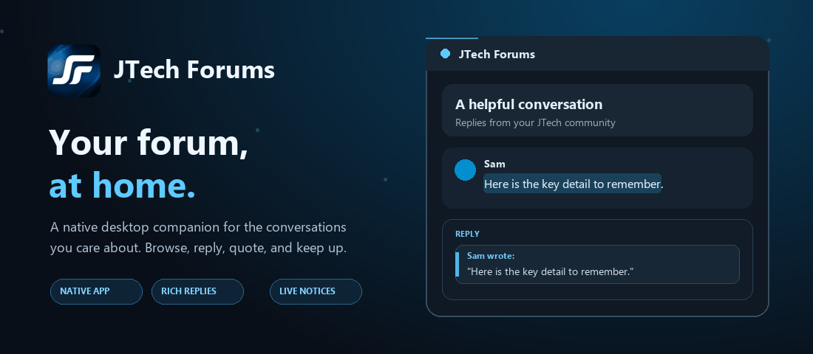

# JTech Forums Desktop

**Your forum, at home.** A native desktop companion for the conversations you care about.

## Get the app

Download the installer for your computer from [Releases](https://github.com/Fleishigs/jtechforums-desktop-releases/releases/latest).

- **Windows:** `.msi` installer
- **macOS:** `.dmg` disk image
- **Linux:** `.deb` package for Debian and Ubuntu

Windows may show a publisher warning because the installer is not code-signed. macOS may ask you to approve opening an app downloaded from the internet.

## Made for conversations

- Browse categories and topic feeds, with unread counts and saved reading positions.
- Select a sentence to quote it in a reply, or copy a complete attributed forum quote.
- Compose formatted posts with a live preview, tags, and image uploads.
- Keep up with replies through in-app and desktop notifications.
- Open private messages, profiles, search, and account settings without leaving the app.
- Use a keyboard-friendly native interface built with Kotlin Multiplatform and Compose Multiplatform. There are no embedded web pages.

## Built for the desktop

This is a community-built client for JTech Forums members. It uses the forum's Discourse API with your account and is not an official JTech Forums organization release. The Kotlin Multiplatform source repository is private; this repository contains releases and this self-contained project showcase.

The app is free to use. Optional support is available at [Buy Me a Coffee](https://buymeacoffee.com/samsclub). Created by [Fleishigs](https://github.com/Fleishigs).
